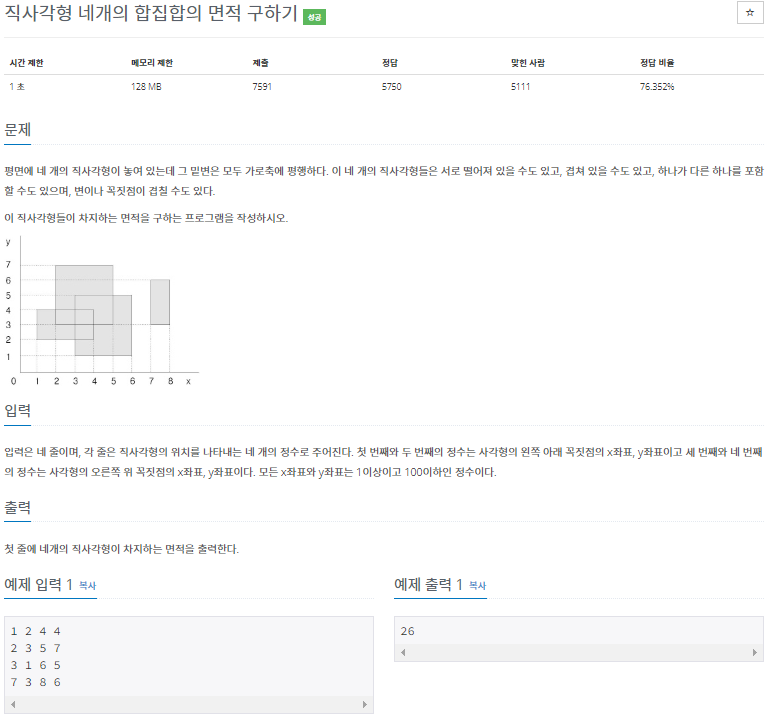

# 2022080819_백준2669_직사각형네개의합집합의면적구하기_송경삼


**1. 문제**



이 전에 풀었던 색종이와 비슷한 종류의 문제입니다. 주어진 영역을 순회하면서 해당영역의 값을 조건에 따라 갱신하며 푸는 문제라고 생각하고 풀이를 시작했습니다.


**2. 나의 풀이**

```python
B=[[0]*101 for _ in '_'*101]    #도화지
c=0 #카운트
for _ in '_'*4: #input을 받고
    x1,y1,x2,y2=map(int,input().split())
    for x in range(x1,x2):
        for y in range(y1,y2):  #해당 영역을 순회하면서
            if not B[x][y]:B[x][y]=1;c+=1   #비어있을경우 칠하고 카운트
print(c)
```


미리 칠할 공간을 만들고 인풋을 순회하면서 해당 공간이 비어있을 경우에만 카운트를 해주는 형식의 로직입니다.


**3. 다른풀이와 비교**

```python
o={0}
for a in open(0):
 q,w,e,r=map(int,a.split())
 o|={(x,y)for x in range(q,e)for y in range(w,r)}
print(len(o)-1)
```


백준 아이디 [noye](https://www.acmicpc.net/user/noye) 님의 풀이입니다.

처음에는 비트 연산인줄 알고 해석하는데에 어려움이 있었으나, set라는 걸 금방 다시 깨달아 한 수 배웠습니다. 비어있을 경우에는 카운트 하지 않는다는 로직을 set의 집합 연산을 통해 해결했습니다. 카운트의 출력만 필요하니 전혀 문제될 것 없는 풀이입니다.


**4. 느낀점**

여러 문제들을 풀면서 dict를 활용하는 법에 재미들리던 참이었는데 생각해보니 set는 고려도 안했었단 걸 깨달았습니다. set의 활용법 또한 하나 둘 익혀가야겠습니다.


*출처

https://www.acmicpc.net/problem/2669
