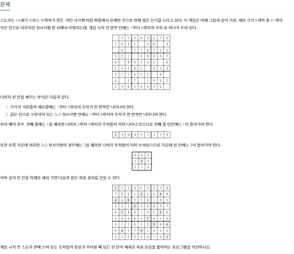

# 20220907_Cpp_백준_2580_스도쿠_송경삼

**1. 문제**



문제 자체는 쉽습니다. 스도쿠를 완성하면 되는 문제였습니다. 하지만 제가 이 문제가 빽트래킹 문제라는 걸 알고 들어와서 바로 빽트래킹으로 풀려고했지만, 만약 빽트래킹 문제가 아니었다면 분명 스택과 for문을 통해 해결하려고 했을 것 같습니다.


**2. 나의 풀이**

```cpp
#include <iostream>
#include <vector>
#include <stdlib.h>

struct D2 { //좌표를 저장에 쓰일 구조체입니다.
	int I;
	int J;
};

std::vector<D2> IJ; //좌표 배열입니다.
int L[9][9];    //인풋과 아웃풋에 쓰일 2차원배열입니다.
int c,N;


bool check(int k, int l, int n) {   //좌표를 받아 해당 좌표에 n이 들어갈 수 있는지 확인하는 함수입니다.
	for (int x = 0; x < 9; x++)  {
		if (L[x][l] == n) { return 1; } //세로판단
	}
	for (int y = 0; y < 9; y++) {
		if (L[k][y] == n) { return 1; } //가로판단
	}
	k = (k / 3)*3;
	l = (l / 3)*3;
	for (int x = 0; x < 3; x++) {
		for (int y = 0; y < 3; y++) {
			if (L[k + x][l + y] == n) { return 1; } //네모 판단
		}
	}
	return 0;   //들어갈 수 있다면 0을 들어갈 수 없다면 1을 반환합니다.
}


void BT(int c){ //빽트래킹이고 c는 재귀깊이입니다.
	if (c == N) {   //만약 재귀 깊이 끝까지 도달했다면
		for (int i = 0; i < 9; i++) {
			for (int j = 0; j < 9; j++) {
				std::cout << L[i][j] << " ";
			}
			if (i!=8) std::cout << "\n";    //스도쿠 판을 인쇄하고
		}
		exit(0);    //프로그램을 종료합니다.
	}


	else {  //재귀 깊이 끝에도달하지 않았다면
		int k = IJ[c].I,l = IJ[c].J;    //현재 재귀깊이의 채워야할 i,j값을 받아서
		for (int n = 1; n <= 9; n++) {
			if (check(k, l, n)) { continue; }   //해당 한에 n이 들어갈 수 있는지 확인합니다. 없다면 넘어갑니다.
			L[k][l] = n; //있다면 n을넣고
			BT(c + 1);  //재귀를 보냅니다.
			k = IJ[c].I;    //컨디션에 막혀 돌아왔다면
			l = IJ[c].J;    //k랑 l을 리셋해주고
			L[k][l] = 0;    //n을 지웁니다.
		}
	}
}


int main() {
	std::ios::sync_with_stdio(0);
	std::cin.tie(0);
	std::cout.tie(0);
	for (int i = 0; i < 9; i++) {
		for (int j = 0; j < 9; j++) {
			std::cin >> L[i][j];
			if (L[i][j] == 0) {
				D2 ij = {i,j};
				IJ.push_back(ij);   //인풋을 받으면서 해당 칸이 채워야할 칸이라면 좌표배열에 저장합니다.
			}
		}
	}
	N = IJ.size();
	BT(0);
}
```


ㅁ

**3. 다른풀이와 비교**

```cpp
#include <iostream>
using namespace std;
int a[10][10];
bool c[10][10];
bool c2[10][10];
bool c3[10][10];
int n=9;
int cnt=0;
int square(int x, int y) {
    return (x/3)*3+(y/3);
}
bool go(int z) {
    cnt += 1;
    if (cnt >= 10000000) {
        return true;
    }
    if (z == 81) {
        for (int i=0; i<n; i++) {
            for (int j=0; j<n; j++) {
                cout << a[i][j] << ' ';
            }
            cout << '\n';
        }
        return true;
    }
    int x = z/n;
    int y = z%n;
    if (a[x][y] != 0) {
        return go(z+1);
    } else {
        for (int i=1; i<=9; i++) {
            if (c[x][i] == 0 && c2[y][i] == 0 && c3[square(x,y)][i]==0) {
                c[x][i] = c2[y][i] = c3[square(x,y)][i] = true;
                a[x][y] = i;
                if (go(z+1)) {
                    return true;
                }
                a[x][y] = 0;
                c[x][i] = c2[y][i] = c3[square(x,y)][i] = false;
            }
        }
    }
    return false;
}
int main() {
    for (int i=0; i<n; i++) {
        for (int j=0; j<n; j++) {
            cin >> a[i][j];
            if (a[i][j] != 0) {
                c[i][a[i][j]] = true;
                c2[j][a[i][j]] = true;
                c3[square(i,j)][a[i][j]] = true;
            }
        }
    }
    go(0);
    return 0;
}

//12095 문제에 있는 코드 얼마나 걸리나 테스트해봐요~
```


ㅁ

**4. 개선 및 후기**


*출처

https://www.acmicpc.net/problem/2580
