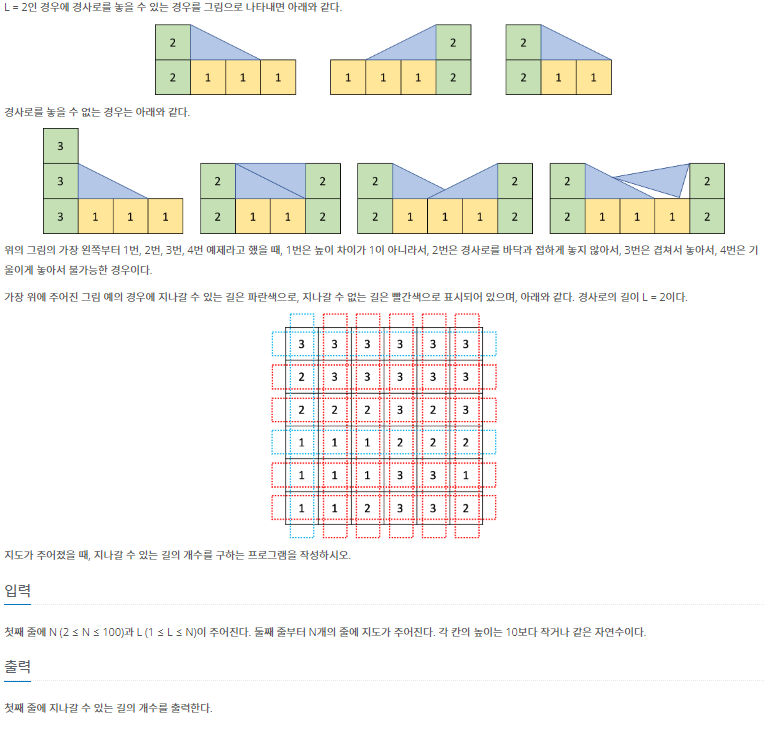

# 20220923_Cpp_백준_14890_경사로_송경삼

### 1. 문제




### 2. 나의 풀이

```cpp
#include <iostream>

int di[4] = { 0,0,-1,1 }, dj[4] = { 1,-1,0,0 };

int main() {
    int N, L,cant1,cant2;
    scanf("%d %d", &N, &L);
    int road[100][100];                        //길의 높이를 저장할 공간입니다.
    bool DP[100][100][2] = { 0, };            //계단을 설치할 가상공간입니다. 0:가로로설치 1:세로로설치
    bool cant[100][2] = { 0, };                //불가능을 표시합니다 0:가로(열)의 불가능 1:세로(행)의 불가능
    int ans = 2 * N;                        //최선의 경우 가능한 길의 수
    for (int i = 0; i < N; ++i) {
        for (int j = 0; j < N; ++j) {
            scanf("%d", &road[i][j]);        //인풋 받습니다
        }
    }

    for (int i = 0; i < N; ++i) {
        for (int j = 0; j < N; ++j) {
            if (!cant[i][0]) {                //이번 행이 아직 유망할 경우
                for (int d = -1; d <= 1; d += 2) {        //좌 우를 살펴볼겁니다
                    int dj = j + d;                        
                    if (dj < 0 || dj >= N) continue;    //옆에 칸이 있다면 확인해볼것입니다.
                    if (abs(road[i][dj] - road[i][j]) > 1) { cant[i][0] = 1; --ans; } //두칸 차이나면 불가능합니다. 바로 종료하고 이번 행을 더이상 확인하지 않습니다.
                    else if (road[i][dj] + 1 == road[i][j]) {            // 1칸 낮은 곳이 존재한다면
                        for (int l = 1; l <= L; ++l) {                    // 계단 길이 만큼 계단을 깔아볼것입니다.
                            int dl = j + d * l;
                            if (dl < 0 || dl >= N || DP[i][dl][0]) {        // 길을 벗어났거나 이미 계단이 깔려있다면
                                cant[i][0] = 1;                                // 불가능하다고 표시하고 더이상 이번행을 체크하지않습니다.
                                --ans;                                        // 가능 수를 하나 빼줍니다
                                break;
                            }
                            DP[i][dl][0] = 1;                                // 계단을 깔 수 있다면 깔고 넘어갑니다.
                        }
                    }
                    if (cant[i][0]) break;                                
                }
            }
            if (!cant[j][1]) {                                        //위와 같은 작업을 세로로도 진행합니다.
                for (int d = -1; d <= 1; d += 2) {
                    int di = i + d;
                    if (di < 0 || di >= N) continue;

                    if (abs(road[di][j] - road[i][j]) > 1) { cant[j][1] = 1; --ans; }
                    else if (road[di][j] + 1 == road[i][j]) {
                        for (int l = 1; l <= L; ++l) {
                            int dl = i + d * l;
                            if (dl < 0 || dl >= N || DP[dl][j][1]) {
                                cant[j][1] = 1;
                                --ans;
                                break;
                            }
                            DP[dl][j][1] = 1;
                        }
                    }
                    if (cant[j][1]) break;
                }
            }
        }
    }
    printf("%d\n", ans);
}
```

### 3. 다른풀이와 비교

```cpp
//ㅋ
```

ㅁㄴ

### 4. 개선 및 후기

ㅁㄴ

###### *출처

https://www.acmicpc.net/problem/14890

- 문제를 만든 사람: [baekjoon](https://www.acmicpc.net/user/baekjoon)
- 데이터를 추가한 사람: [da3107](https://www.acmicpc.net/user/da3107), [kimyh0316](https://www.acmicpc.net/user/kimyh0316), [qkrjh0904](https://www.acmicpc.net/user/qkrjh0904)
